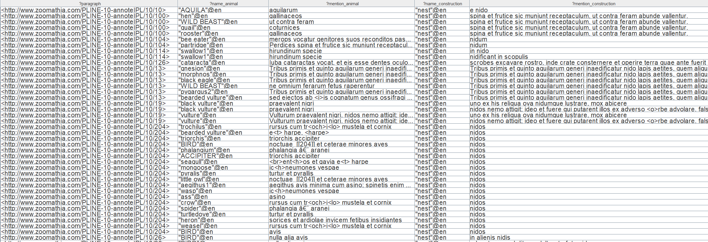
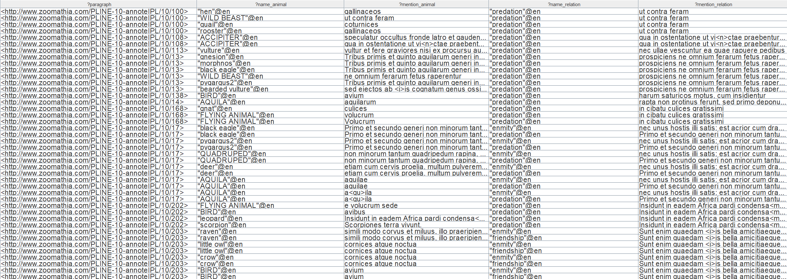
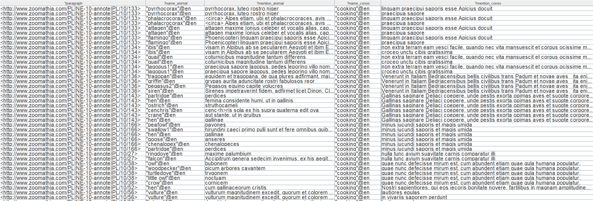

## Patch note

La récupération des résultats via Corèse n'est possible qu'a travers un graphe (XML). Il serait bien de faire un script Python qui transforme les réponses du graphe en CSV (possible avec Py4J et la Corese-Python-Lib) pour pouvoir faire une vérification minutieuse des résultats.  Je proposerai ça à terme, ce qui donnera une base pour le développement d'un "web application" Django.

## Préfixes utilisés

```SPARQL
prefix oa:     <http://www.w3.org/ns/oa#>.
prefix skos: <http://www.w3.org/2004/02/skos/core#>.
prefix schema:  <http://schema.org/> .
```


## Requêtes statistiques et tests

- Nombre d'annotation et nombre de concept distinct présent

```SPARQL
PREFIX oa:     <http://www.w3.org/ns/oa#>.
PREFIX skos: <http://www.w3.org/2004/02/skos/core#>.

select distinct (count(?x) as ?an) (count(distinct ?y) as ?nb) where {
  ?x a oa:Annotation;
	oa:hasBody ?y.
  ?y a skos:Concept
}

```

-> 10601 annotations et 1482 concepts différents

- Top 10 des concepts les plus récurent

```SPARQL
PREFIX oa:     <http://www.w3.org/ns/oa#>.
PREFIX skos: <http://www.w3.org/2004/02/skos/core#>.

select distinct ?label (count(?x) as ?nb) where {
  ?x a oa:Annotation;
	oa:hasBody ?y.
  ?y a skos:Concept; skos:prefLabel ?label.
  filter (lang(?label) = "en")
}
GROUP BY ?label
ORDER BY DESC (?nb)
```

| Concept                           | Occurence |
| --------------------------------- | --------- |
| "historical character"@en         | 253       |
| "size"@en                         | 188       |
| "habitat"@en                      | 182       |
| "intellectual authority"@en       | 178       |
| "nourishment"@en                  | 150       |
| "anecdote"@en                     | 111       |
| "similarity to another animal"@en | 111       |
| "female"@en                       | 107       |
| "male"@en                         | 104       |
| "color"@en                        | 103       |


## Requêtes métiers

### Quels sont les animaux qui construisent un habitat (textes où l’on parle de cette construction)

<u>Reformulation:</u> Les annotations qui mentionnent un animal et une construction d'habitation étant dans le même paragraphe.

<u>Note:</u> généralisation de l'animal faisant parti de la **collection** "Archéotaxon" ("Ancient class" en anglais)

<u>Sortie:</u> Le paragraphe, l'animal (concept), le texte mentionnant l'animal, la construction (concept), le texte mentionnant la construction

```SPARQL
PREFIX oa:     <http://www.w3.org/ns/oa#>.
PREFIX skos: <http://www.w3.org/2004/02/skos/core#>.
PREFIX schema:  <http://schema.org/> .

SELECT DISTINCT ?paragraph ?name_animal ?mention_animal ?name_construction ?mention_construction WHERE {
  ?annotation1 a oa:Annotation;
              oa:hasBody ?animal;
              oa:hasTarget ?target1.
  ?target1 oa:hasSource ?paragraph;
     oa:hasSelector ?selector.
    
  ?selector oa:exact ?mention_animal.

  ?animal a skos:Concept;
       skos:prefLabel ?name_animal.
    
  ?animal_collection a skos:Collection;
       skos:prefLabel ?name_animal_collection;
       skos:member ?animal.

  ?annotation2 oa:hasBody ?construction;
        oa:hasTarget ?target2.
  ?target2 oa:hasSource ?paragraph;
      oa:hasSelector ?selector2.
  ?selector2 oa:exact ?mention_construction.

  ?construction skos:prefLabel ?name_construction;
     	            skos:broader+ ?construction_generique.
  ?construction_generique skos:prefLabel ?name_construction_generique.

  FILTER (str(?name_animal_collection) = "Ancient class").
  FILTER (str(?name_construction_generique) = "house building").
  FILTER (lang(?name_animal) = "en").
  FILTER (lang(?name_construction) = "en")
}
ORDER BY ?paragraph
```

<u>Extrait de réponse de la requête:</u>



### Quelles anecdotes mettant en relation un homme et un animal (pas toutes les relations hommes/animaux, comme la chasse, etc., mais seulement les situations individuelles, qui seront probablement marquées par un nom propre, ou un nom de lieu, etc.)

Reformulation: Les annotation mentionnant une anecdote, une relation homme/animal faisant parti du même paragraphe.

Note: Je me suis restreint à des relations spéciales (prédation, enmity, friendship)

```SPARQL
PREFIX oa:     <http://www.w3.org/ns/oa#>.
PREFIX skos: <http://www.w3.org/2004/02/skos/core#>.
PREFIX schema:  <http://schema.org/> .
PREFIX paragraph: <http://www.zoomathia.com/>.

SELECT DISTINCT ?paragraph ?name_animal ?mention_animal ?name_relation ?mention_relation WHERE {
  ?annotation1 a oa:Annotation;
              oa:hasBody ?animal;
              oa:hasTarget ?target1.
  ?target1 oa:hasSource ?paragraph;
     oa:hasSelector ?selector.
    
  ?selector oa:exact ?mention_animal.

  ?animal a skos:Concept;
       skos:prefLabel ?name_animal.
    
  ?animal_collection a skos:Collection;
       skos:prefLabel ?name_animal_collection;
       skos:member ?animal.

  ?annotation2 oa:hasBody ?relation;
        oa:hasTarget ?target2.
  ?target2 oa:hasSource ?paragraph;
      oa:hasSelector ?selector2.
  ?selector2 oa:exact ?mention_relation.

  ?relation skos:prefLabel ?name_relation;
     	            skos:broader+ ?relation_generique.
  ?relation_generique skos:prefLabel ?name_relation_generique.

  FILTER (str(?name_animal_collection) = "Ancient class").
  FILTER (str(?name_relation_generique) = "special relationship").
  FILTER (lang(?name_animal) = "en").
  FILTER (lang(?name_relation) = "en")
}
ORDER BY ?paragraph
```

Extrait résultat:



### Quels sont les oiseaux qui sont consommés (gastronomie)

Reformulation: Les annotations mentionnant un oiseau et une gastronomie faisant parti du même paragraphe

Note: L'insertion d'une collection Oiseau serait intéressante.

```SPARQL
PREFIX oa:     <http://www.w3.org/ns/oa#>.
PREFIX skos: <http://www.w3.org/2004/02/skos/core#>.
PREFIX schema:  <http://schema.org/> .

SELECT DISTINCT ?paragraph ?name_animal ?mention_animal ?name_conso ?mention_conso WHERE {
  ?annotation1 a oa:Annotation;
              oa:hasBody ?animal;
              oa:hasTarget ?target1.
  ?target1 oa:hasSource ?paragraph;
     oa:hasSelector ?selector.
    
  ?selector oa:exact ?mention_animal.

  ?animal a skos:Concept;
       skos:prefLabel ?name_animal;
       skos:broader+ ?animal_generique.
    
  ?animal_generique a skos:Concept;
       skos:prefLabel ?name_animal_generique.

  ?annotation2 oa:hasBody ?conso;
        oa:hasTarget ?target2.
  ?target2 oa:hasSource ?paragraph;
      oa:hasSelector ?selector2.
  ?selector2 oa:exact ?mention_conso.

  ?conso skos:prefLabel ?name_conso;
     	            skos:broader+ ?conso_generique.
  ?conso_generique skos:prefLabel ?name_conso_generique.

  FILTER (str(?name_animal_generique) in ("BIRD","BIRD WITH CLAW","BIRD WITH TOES","WATERBIRD","NIGHT BIRD","MIGRATORY BIRD", "PALMIPED BIRD")).
  FILTER (str(?name_conso_generique) = "animal in human nourishing").
  FILTER (lang(?name_animal) = "en").
  FILTER (lang(?name_conso) = "en")
}
ORDER BY ?paragraph
```

Extrait résultat:



### Quels sont les remèdes (thérapeutiques) qui incluent une langue animale (ou un morceau de langue)?

Reformulation: Les annotations qui mentionnent un remède , <u>**une langue et un animal**</u> faisant parti du même paragraphe

Note: Difficile de trouver le concept "remède thérapeutique" ou "remède". Dans la hiérarchie, il existe remède vétérinaire (erreur dans l'accent utilisé dans le thésaurus). https://opentheso.huma-num.fr/opentheso/?idc=105552&idt=th310

Il est possible de trouver les mentions de langue et l'animal en question cependant.

```sparql
PREFIX oa:     <http://www.w3.org/ns/oa#>.
PREFIX skos: <http://www.w3.org/2004/02/skos/core#>.
PREFIX schema:  <http://schema.org/> .

SELECT DISTINCT ?paragraph ?name_animal ?mention_animal ?name_construction ?mention_construction WHERE {
  ?annotation1 a oa:Annotation;
              oa:hasBody ?animal;
              oa:hasTarget ?target1.
  ?target1 oa:hasSource ?paragraph;
     oa:hasSelector ?selector.
    
  ?selector oa:exact ?mention_animal.

  ?animal a skos:Concept;
       skos:prefLabel ?name_animal.
    
  ?animal_collection a skos:Collection;
       skos:prefLabel ?name_animal_collection;
       skos:member ?animal.

  ?annotation2 oa:hasBody ?construction;
        oa:hasTarget ?target2.
  ?target2 oa:hasSource ?paragraph;
      oa:hasSelector ?selector2.
  ?selector2 oa:exact ?mention_construction.

  ?construction skos:prefLabel ?name_construction;
     	            skos:broader+ ?construction_generique.
  ?construction_generique skos:prefLabel ?name_construction_generique.

  FILTER (str(?name_animal_collection) = "Ancient class").
  FILTER (str(?name_construction_generique) = "house building").
  FILTER (lang(?name_animal) = "en").
  FILTER (lang(?name_construction) = "en")
}
ORDER BY ?paragraph
```

Extrait résultat:


### Quels sont les animaux qui communiquent entre eux (textes où il est question de mode de communication, de langage, etc.)?

```sparql
PREFIX oa:     <http://www.w3.org/ns/oa#>.
PREFIX skos: <http://www.w3.org/2004/02/skos/core#>.
PREFIX schema:  <http://schema.org/> .

SELECT DISTINCT ?paragraph ?name_animal ?mention_animal ?name_construction ?mention_construction WHERE {
  ?annotation1 a oa:Annotation;
              oa:hasBody ?animal;
              oa:hasTarget ?target1.
  ?target1 oa:hasSource ?paragraph;
     oa:hasSelector ?selector.
    
  ?selector oa:exact ?mention_animal.

  ?animal a skos:Concept;
       skos:prefLabel ?name_animal.
    
  ?animal_collection a skos:Collection;
       skos:prefLabel ?name_animal_collection;
       skos:member ?animal.

  ?annotation2 oa:hasBody ?construction;
        oa:hasTarget ?target2.
  ?target2 oa:hasSource ?paragraph;
      oa:hasSelector ?selector2.
  ?selector2 oa:exact ?mention_construction.

  ?construction skos:prefLabel ?name_construction;
     	            skos:broader+ ?construction_generique.
  ?construction_generique skos:prefLabel ?name_construction_generique.

  FILTER (str(?name_animal_collection) = "Ancient class").
  FILTER (str(?name_construction_generique) = "house building").
  FILTER (lang(?name_animal) = "en").
  FILTER (lang(?name_construction) = "en")
}
ORDER BY ?paragraph
```


### Sur le rythme alimentaire des animaux : quels sont les animaux capables de jeûner, quelles sont les informations sur les rythmes de repas (fréquence)?

 ```sparql
 PREFIX oa:     <http://www.w3.org/ns/oa#>.
 PREFIX skos: <http://www.w3.org/2004/02/skos/core#>.
 PREFIX schema:  <http://schema.org/> .
 
 SELECT DISTINCT ?paragraph ?name_animal ?mention_animal ?name_construction ?mention_construction WHERE {
   ?annotation1 a oa:Annotation;
               oa:hasBody ?animal;
               oa:hasTarget ?target1.
   ?target1 oa:hasSource ?paragraph;
      oa:hasSelector ?selector.
     
   ?selector oa:exact ?mention_animal.
 
   ?animal a skos:Concept;
        skos:prefLabel ?name_animal.
     
   ?animal_collection a skos:Collection;
        skos:prefLabel ?name_animal_collection;
        skos:member ?animal.
 
   ?annotation2 oa:hasBody ?construction;
         oa:hasTarget ?target2.
   ?target2 oa:hasSource ?paragraph;
       oa:hasSelector ?selector2.
   ?selector2 oa:exact ?mention_construction.
 
   ?construction skos:prefLabel ?name_construction;
      	            skos:broader+ ?construction_generique.
   ?construction_generique skos:prefLabel ?name_construction_generique.
 
   FILTER (str(?name_animal_collection) = "Ancient class").
   FILTER (str(?name_construction_generique) = "house building").
   FILTER (lang(?name_animal) = "en").
   FILTER (lang(?name_construction) = "en")
 }
 ORDER BY ?paragraph
 ```


### Quelles sont les données transmises sur le temps de gestation des animaux?

```sparql
```


### Quelles sont les expérimentations faites sur les animaux (contexte, description…)?

```SPARQL
PREFIX oa:     <http://www.w3.org/ns/oa#>.
PREFIX skos: <http://www.w3.org/2004/02/skos/core#>.
PREFIX schema:  <http://schema.org/> .

SELECT DISTINCT ?paragraph ?name_animal ?mention_animal ?name_construction ?mention_construction WHERE {
  ?annotation1 a oa:Annotation;
              oa:hasBody ?animal;
              oa:hasTarget ?target1.
  ?target1 oa:hasSource ?paragraph;
     oa:hasSelector ?selector.
    
  ?selector oa:exact ?mention_animal.

  ?animal a skos:Concept;
       skos:prefLabel ?name_animal.
    
  ?animal_collection a skos:Collection;
       skos:prefLabel ?name_animal_collection;
       skos:member ?animal.

  ?annotation2 oa:hasBody ?construction;
        oa:hasTarget ?target2.
  ?target2 oa:hasSource ?paragraph;
      oa:hasSelector ?selector2.
  ?selector2 oa:exact ?mention_construction.

  ?construction skos:prefLabel ?name_construction;
     	            skos:broader+ ?construction_generique.
  ?construction_generique skos:prefLabel ?name_construction_generique.

  FILTER (str(?name_animal_collection) = "Ancient class").
  FILTER (str(?name_construction_generique) = "house building").
  FILTER (lang(?name_animal) = "en").
  FILTER (lang(?name_construction) = "en")
}
ORDER BY ?paragraph
```


### Quels sont les animaux typiques de l’Afrique (qui ne sont pas considérés comme des variantes d’animaux connus en Europe, telles les moutons (ici d’Afrique), les lions (ici d’Afrique, mais il y en a aussi en Europe et en Asie)

```SPARQL
PREFIX oa:     <http://www.w3.org/ns/oa#>.
PREFIX skos: <http://www.w3.org/2004/02/skos/core#>.
PREFIX schema:  <http://schema.org/> .

SELECT DISTINCT ?paragraph ?name_animal ?mention_animal ?name_construction ?mention_construction WHERE {
  ?annotation1 a oa:Annotation;
              oa:hasBody ?animal;
              oa:hasTarget ?target1.
  ?target1 oa:hasSource ?paragraph;
     oa:hasSelector ?selector.
    
  ?selector oa:exact ?mention_animal.

  ?animal a skos:Concept;
       skos:prefLabel ?name_animal.
    
  ?animal_collection a skos:Collection;
       skos:prefLabel ?name_animal_collection;
       skos:member ?animal.

  ?annotation2 oa:hasBody ?construction;
        oa:hasTarget ?target2.
  ?target2 oa:hasSource ?paragraph;
      oa:hasSelector ?selector2.
  ?selector2 oa:exact ?mention_construction.

  ?construction skos:prefLabel ?name_construction;
     	            skos:broader+ ?construction_generique.
  ?construction_generique skos:prefLabel ?name_construction_generique.

  FILTER (str(?name_animal_collection) = "Ancient class").
  FILTER (str(?name_construction_generique) = "house building").
  FILTER (lang(?name_animal) = "en").
  FILTER (lang(?name_construction) = "en")
}
ORDER BY ?paragraph
```


### Quels sont les caractéristiques comportementaux des rongeurs, ou des souris ?

```SPARQL
PREFIX oa:     <http://www.w3.org/ns/oa#>.
PREFIX skos: <http://www.w3.org/2004/02/skos/core#>.
PREFIX schema:  <http://schema.org/> .

SELECT DISTINCT ?paragraph ?name_animal ?mention_animal ?name_construction ?mention_construction WHERE {
  ?annotation1 a oa:Annotation;
              oa:hasBody ?animal;
              oa:hasTarget ?target1.
  ?target1 oa:hasSource ?paragraph;
     oa:hasSelector ?selector.
    
  ?selector oa:exact ?mention_animal.

  ?animal a skos:Concept;
       skos:prefLabel ?name_animal.
    
  ?animal_collection a skos:Collection;
       skos:prefLabel ?name_animal_collection;
       skos:member ?animal.

  ?annotation2 oa:hasBody ?construction;
        oa:hasTarget ?target2.
  ?target2 oa:hasSource ?paragraph;
      oa:hasSelector ?selector2.
  ?selector2 oa:exact ?mention_construction.

  ?construction skos:prefLabel ?name_construction;
     	            skos:broader+ ?construction_generique.
  ?construction_generique skos:prefLabel ?name_construction_generique.

  FILTER (str(?name_animal_collection) = "Ancient class").
  FILTER (str(?name_construction_generique) = "house building").
  FILTER (lang(?name_animal) = "en").
  FILTER (lang(?name_construction) = "en")
}
ORDER BY ?paragraph
```


### quelles sont les paires d’animaux (régulièrement associés) qui sont dans un rapport spécial d’affection (sympathie) ou de haine (antipathie)?

```SPARQL
PREFIX oa:     <http://www.w3.org/ns/oa#>.
PREFIX skos: <http://www.w3.org/2004/02/skos/core#>.
PREFIX schema:  <http://schema.org/> .

SELECT DISTINCT ?paragraph ?name_animal ?mention_animal ?name_construction ?mention_construction WHERE {
  ?annotation1 a oa:Annotation;
              oa:hasBody ?animal;
              oa:hasTarget ?target1.
  ?target1 oa:hasSource ?paragraph;
     oa:hasSelector ?selector.
    
  ?selector oa:exact ?mention_animal.

  ?animal a skos:Concept;
       skos:prefLabel ?name_animal.
    
  ?animal_collection a skos:Collection;
       skos:prefLabel ?name_animal_collection;
       skos:member ?animal.

  ?annotation2 oa:hasBody ?construction;
        oa:hasTarget ?target2.
  ?target2 oa:hasSource ?paragraph;
      oa:hasSelector ?selector2.
  ?selector2 oa:exact ?mention_construction.

  ?construction skos:prefLabel ?name_construction;
     	            skos:broader+ ?construction_generique.
  ?construction_generique skos:prefLabel ?name_construction_generique.

  FILTER (str(?name_animal_collection) = "Ancient class").
  FILTER (str(?name_construction_generique) = "house building").
  FILTER (lang(?name_animal) = "en").
  FILTER (lang(?name_construction) = "en")
}
ORDER BY ?paragraph
```


### Quels sont les objets techniques réalisés avec des parties animales (peau, os, cornes…)?

```SPARQL
PREFIX oa:     <http://www.w3.org/ns/oa#>.
PREFIX skos: <http://www.w3.org/2004/02/skos/core#>.
PREFIX schema:  <http://schema.org/> .

SELECT DISTINCT ?paragraph ?name_animal ?mention_animal ?name_construction ?mention_construction WHERE {
  ?annotation1 a oa:Annotation;
              oa:hasBody ?animal;
              oa:hasTarget ?target1.
  ?target1 oa:hasSource ?paragraph;
     oa:hasSelector ?selector.
    
  ?selector oa:exact ?mention_animal.

  ?animal a skos:Concept;
       skos:prefLabel ?name_animal.
    
  ?animal_collection a skos:Collection;
       skos:prefLabel ?name_animal_collection;
       skos:member ?animal.

  ?annotation2 oa:hasBody ?construction;
        oa:hasTarget ?target2.
  ?target2 oa:hasSource ?paragraph;
      oa:hasSelector ?selector2.
  ?selector2 oa:exact ?mention_construction.

  ?construction skos:prefLabel ?name_construction;
     	            skos:broader+ ?construction_generique.
  ?construction_generique skos:prefLabel ?name_construction_generique.

  FILTER (str(?name_animal_collection) = "Ancient class").
  FILTER (str(?name_construction_generique) = "house building").
  FILTER (lang(?name_animal) = "en").
  FILTER (lang(?name_construction) = "en")
}
ORDER BY ?paragraph
```

